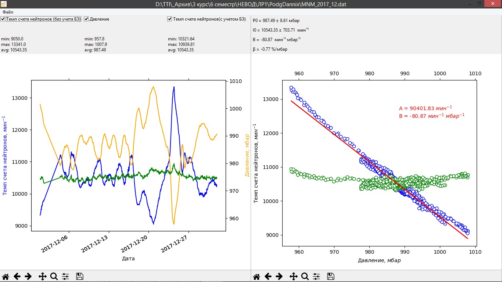

# Uragan

Программа расчета барометрических коэффициентов для мюонного годоскопа УРАГАН (МГ) и московского нейтронного монитора (МНМ, ИЗМИРАН).

Создана для выполнения лабораторной работы "Исследование барометрического эффекта в потоке мюонов и нейтронов", описание работы находится в файле [ЛаптевАП_Отчет.docx](./ЛаптевАП_Отчет.docx).

Данные с мюонного годоскопа УРАГАН (МГ) и московского нейтронного монитора (МНМ, ИЗМИРАН) находятся в папке [testData](./testData/)

Использованные технологии:
* Python 3.7
* matplotlib
* wxWidgets

